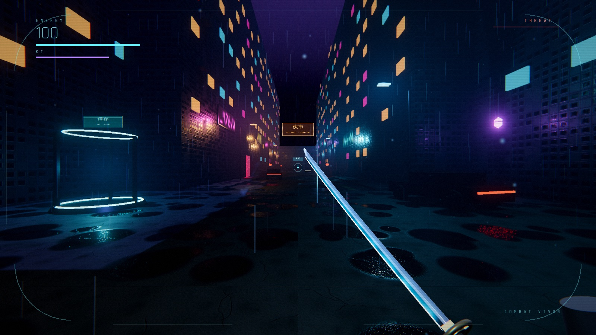
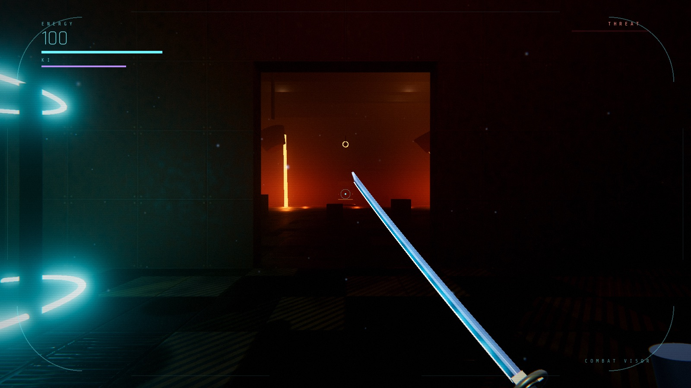
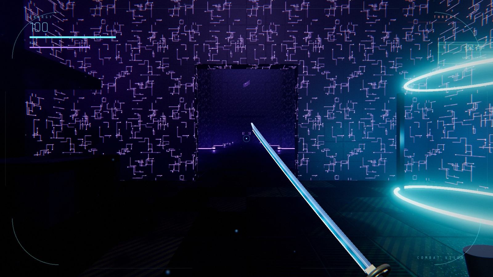
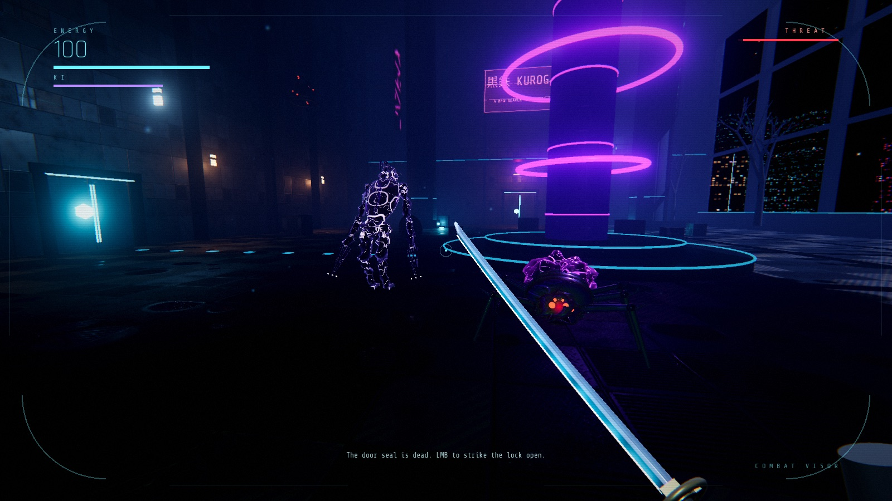

# SLASHBOY

A Metroid Prime-style first-person action game. You are a kage-class operative with an energy katana,
sent into the silent orbital arcology KUROGANE-9.

You wake in the dark with a blade, a visor and no map. KUROGANE-9 went silent forty-one hours ago, and whatever
replaced its crew has grown through the walls. Fight in tight, melee-first first-person combat (parry, deflect
plasma, dash through enemies, charge arc waves), scan the world for lore and weak points, and unlock traversal
abilities that open up the interconnected sectors behind you. Rain-slick neon streets, molten foundries and
cold data vaults are lit in real time with volumetric fog, and every sound is generated, so it's best played
with headphones in the dark.

| | |
|---|---|
|  |  |
| **Undercity**: the rain-soaked hub below the arcology | **Foundry**: a smelting hall over a lava river |
|  |  |
| **Archives**: data stacks guarded by the Archivist | **Ring C**: some of the things living in the concourse |

There are two builds in this repo:

| Build | Where | Status |
|---|---|---|
| **Native (Godot 4.7, Metal)** | `godot/` | Main version. Volumetric fog, real-time GI options, MetalFX upscaling |
| Browser (Three.js) | `index.html`, `src/` | Original prototype, kept for reference |

## The game (native build)

Five sectors, four abilities, five bosses, 12 hidden upgrades. Save stations auto-save; **Continue** on the title screen resumes.

| Sector | Setting | Boss | Reward |
|---|---|---|---|
| 1 · Ring C | Docking ring, maintenance spine, grand concourse, hydroponics vault | Stalker ambush | Lift to the Undercity |
| 2 · Undercity (hub) | Rain-soaked neon chasm floor, night market, the Gap, subway station | **Matriarch** (brood queen) | Kusari Grapple |
| 3 · Foundry | Smelting hall over a lava river, press line, coolant control | **Warden** (shielded mech) | Phase Step |
| 4 · Archives | Data stacks, index-lock scan puzzle, cold storage | **Archivist** (teleporting hologram, decoys) | Kage Leap |
| 5 · Bloom Heart | The Gut, the Throat (vertical shaft), the Heart chamber | **Bloom Heart** → **Avatar** | Escape → ending |

The Bloom Heart lift in the Undercity opens once both the Warden and the Archivist are down. After the
Avatar falls you have three minutes to climb the Throat (grapple anchor to anchor) and ride the lift out.
Energy tanks (+25 energy) and ki shards (+15 ki) are hidden behind grapple anchors, phase barriers and
Kage Leap ledges, so it pays to revisit earlier sectors.

## Run the native build

Requires Godot 4.7 (`brew install --cask godot`).

```
./play.sh                       # windowed; F11 toggles fullscreen
./play.sh -- --quality=ultra    # start on a specific preset
```

Or open `godot/project.godot` in the Godot editor and press Play.

Use headphones and play in the dark.

### Graphics presets (press `G` in game)

Each preset has an internal pixel budget. On Apple silicon, MetalFX Temporal upscales when the window is bigger
than the budget, and dynamic resolution trims the render scale to hold ~60 fps.

| Preset | Budget | Adds |
|---|---|---|
| MEDIUM | 1.5 MP | AO, volumetric fog |
| HIGH (default) | 2.4 MP | + screen-space indirect light, reflections |
| ULTRA | 3.6 MP | + SDFGI global illumination, finer fog |

Measured on an M1 Pro, fullscreen: HIGH 63–68 fps at native scale, ULTRA ~60 fps at 0.65 scale.

### Regenerating assets

Textures and sounds are generated by scripts, not hand-made:

```
python3 -m venv tools/.venv && tools/.venv/bin/pip install numpy pillow scipy
tools/.venv/bin/python tools/gen_textures.py   # PBR sets, city, sky, creature skins -> godot/assets/textures
tools/.venv/bin/python tools/write_imports.py  # mipmaps + VRAM compression import settings
tools/.venv/bin/python tools/gen_audio.py      # all SFX, ambience loops, combat music -> godot/assets/audio
```

### Debug harness

Arguments after `--` drive automated checks:

```
./play.sh -- --autostart --warp=34,0,-106 --fps            # jump anywhere, log fps/scale/draw calls
./play.sh -- --autostart --scenario=lineup --shot=out.png --at=8 --quit
godot --headless --path godot -- --autostart --scenario=flow   # end-to-end check of every beat + ending
```

Jump to any sector with `--sector=s1..s5 --entry=<name>` and grant abilities with `--abilities=grapple,phase,leap`;
`--continue` loads the save.

Scenarios: `lineup` (all creatures), `arena`, `cloak` (`--scanmode`, `--visible=1`), `slash`, `scan`, and the
headless end-to-end checks `flow` (Sector 1 → lift), `s2flow`, `s3flow`, `s4flow`, `s5flow` (Heart, Avatar,
escape climb, ending). Run each with the matching `--sector=`, for example:

```
godot --headless --path godot -- --autostart --sector=s5 --entry=lift --abilities=grapple,phase,leap --scenario=s5flow
```

## Run the browser build

```
npm start          # or: python3 -m http.server 8000
```

Open http://localhost:8000 in Chrome.

## Controls

| Input | Action |
|---|---|
| WASD / Mouse | Move / look |
| LMB | Strike (3-hit combo); strikes also open door locks and deflect plasma bolts |
| Hold LMB | Charge an Arc Wave (costs Ki) |
| RMB | Guard. Raise it right as a hit lands to parry or deflect |
| Shift | Phantom Dash (brief invulnerability, cuts through enemies). With Phase Step: passes through barriers and light walls |
| Space | Jump. With Kage Leap: press again in the air to double jump |
| F | Kusari Grapple: zip to anchors, yank enemies, tear off shields and generators |
| M / Tab | Sector map (visited rooms, items found) |
| Q | Lock-on |
| E | Scan visor: read lore, study enemies, see cloaked things |
| R | Kage Focus (slows time, costs Ki) |
| G | Cycle graphics preset |
| F11 | Fullscreen (native build) |

## Native build layout (`godot/`)

| File | What it does |
|---|---|
| `scripts/main.gd` | Bootstrap, environment, quality/upscaling, game loop, debug harness |
| `scripts/level.gd` | Level engine: rooms, lights, doors, holograms, fog volumes, probes, save stations, items, lifts, grapple anchors, phase barriers, lava, crushers |
| `scripts/sectors/` | One script per sector (`sector1.gd` … `sector5.gd`): layout, zones and mood, encounters, story |
| `scripts/g.gd` | Global state, progression (abilities, items, bosses, flags) and the JSON save |
| `scripts/debug_tests.gd` | Headless flow tests for sectors 2–5 |
| `scripts/mesh_builder.gd` | Merges static geometry into chunked meshes with world UVs |
| `scripts/director.gd` | Pacing engine: triggers, wave encounters, zone mood, checkpoints, ending screen |
| `scripts/player.gd`, `katana.gd` | Movement, combat, abilities, scan visor; first-person katana viewport |
| `scripts/enemies/` | Crawler (+hound, mite), Sentinel, Stalker (+Avatar), Bulwark, Turret, Phantom, Spore Pod; bosses Matriarch, Warden, Archivist, Bloom Heart + Tentacle; enemy manager |
| `scripts/audio.gd` | 3D one-shots, room reverb, ambience beds, tension layer, combat music |
| `scripts/fx.gd`, `hud.gd` | Particles, lit dust, steam; visor HUD and menus |
| `shaders/` | Fog noise, chitin, veins, refractive cloak, iris, hologram, visor post-process |
